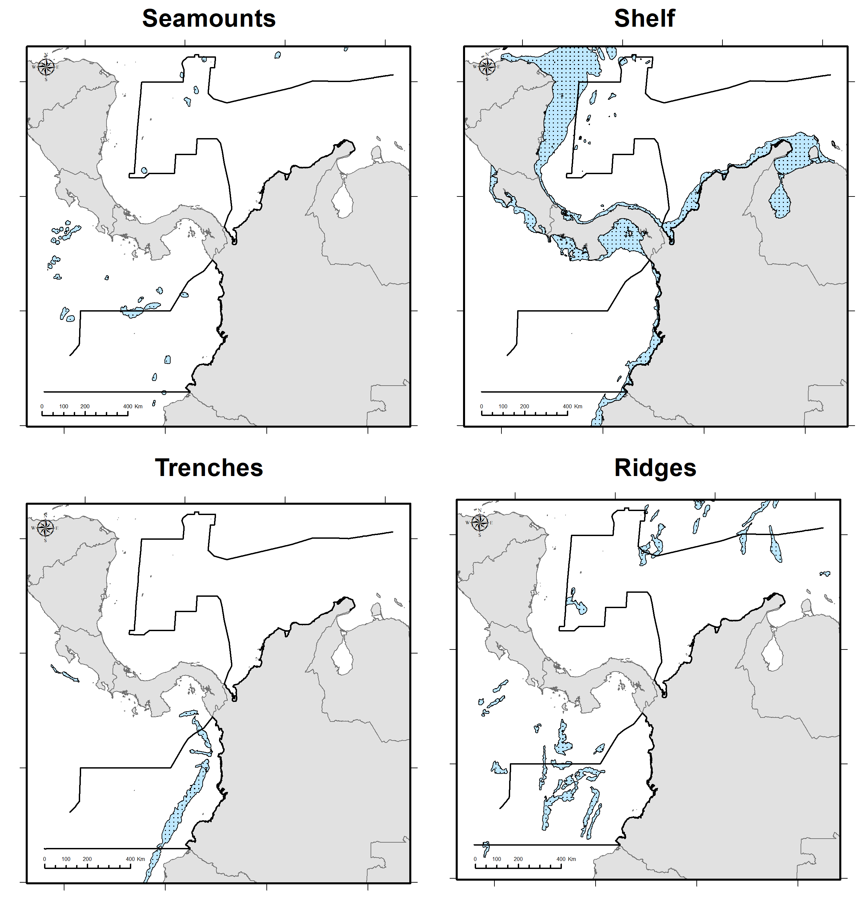
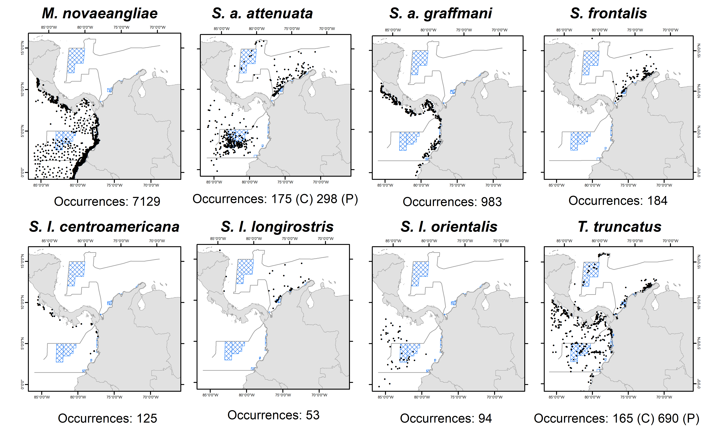
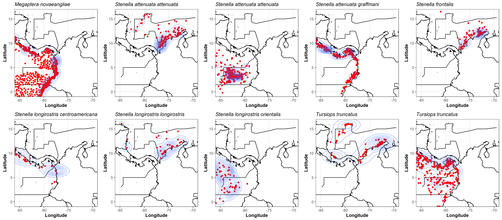
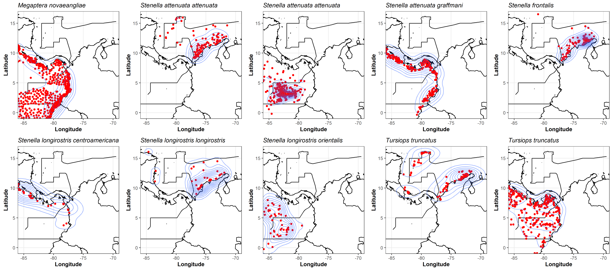

## Data Sources

To evaluate the potential tourist-vessel collision risk for five cetacean species regularly observed in Colombia, we conducted habitat modeling analyses for the following species:

* Atlantic spotted dolphin (*S. frontalis*) for the Caribbean Sea only, as it is endemic to the Atlantic Ocean [@Herzing2018].

* Humpback whale (*M. novaeangliae*) for the Pacific Ocean only, as the Colombian Pacific coast serves as part of the breeding zone for stock G [@Acevedo2017; @Avila2020].

* Bottlenose dolphin (*T. truncatus*) for both Caribbean and Pacific basins.

* Pantropical spotted dolphin (*S. attenuata*) for both basins, but occurrences were separated by subspecies distribution: the offshore pantropical spotted (S. a. attenuata) was analyzed in both basins, while the coastal pantropical spotted (*S. a. graffmani*) was modeled for coastal records in the Pacific basin only, as it is exclusive to the coastal waters of the eastern tropical Pacific [@Jefferson2015; @Perrin2018].

* Spinner dolphin (*S. longirostris*) for both basins, separated by subspecies distribution: the Gray’s spinner (*S. l. longirostris*) for the Caribbean basin, the Eastern spinner (*S. l. orientalis*) for coastal occurrences in the Pacific basin, and the Central American spinner (S. l. centroamericana) for offshore occurrences in the Pacific basin [@Forney2012; @Jefferson2015].

To locate information on the subspecies, a search was conducted using the complete name of each subspecies. The following databases were used: Atlas of Living Australia (ALA, http://www.ala.org.au/), Berkeley Ecoengine (Ecoengine, [https://ecoengine.berkeley.edu/](https://ecoengine.berkeley.edu/)), Biodiversity Information Serving Our Nation (BISON, [https://bison.usgs.gov/](https://bison.usgs.gov/)), Global Biodiversity Information Facility (GBIF,[https://www.gbif.org](https://www.gbif.org) ), Integrated Digitized Biocollections (iDigBio, [https://www.idigbio.org/](https://www.idigbio.org/)), iNaturalist (iNat, [http://www.inaturalist.org/](http://www.inaturalist.org/)), the Ocean Biogeographic Information System (OBIS, [https://obis.org](https://obis.org)), Distributed Databases with Backbone (VertNet, [http://vertnet.org/](http://vertnet.org/)), *Sistema de Información Ambiental Marina* (SIAM, [http://siam.invemar.org.co](http://siam.invemar.org.co)) operated by Colombia's Marine and Coastal Research Institute *INVEMAR*, and the *Red Nacional de Datos Abiertos sobre Biodiversidad de Colombia* (*SiB Colombia*, [https://sibcolombia.net/](https://sibcolombia.net/))


```{r, out.width='75%', fig.align='center', fig.cap='**Figure S2.** Occurrences downloaded from the biodiversity information databases.', echo=FALSE}

```

In addition to the publicly available databases, our study also utilized unpublished data from oceanographic cruises conducted by the *National Maritime Directorate of Colombia* (*DIMAR*) as part of the El Niño Southern Oscillation Regional Study (*ERFEN*). The data was collected by the *Centro de Investigaciones Oceanográficas e Hidrográficas del Pacífico* (*CCCP*) and can be found in the supplementary table 1.

The removal of duplicate records and the filtering of the datasets were performed using a script in the R programming language and packages such as "*tidyverse*"(v. 1.2.0; @Wickham2017), "*dplyr*"(v. 1.0; @Wickham2019), "*anytime*" (v. 0.3.7; @Eddelbuettel2020), "*rgdal*"  (v. 1.5-12; @Bivand2020), "*gdata*" (v. 2.18.0; @Warnes2012), and "*devtools*" (v. 2.3.1; @Wickham2020). This script can be accessed at the following GitHub link: [https://github.com/ChrisBermudezR/Cetacean_Tourist_Vessel_Collision_Risk_Assessment/blob/main/02_Species_Occurrences/01_Occurrence_Data_Download.R](https://github.com/ChrisBermudezR/Cetacean_Tourist_Vessel_Collision_Risk_Assessment/blob/main/02_Species_Occurrences/01_Occurrence_Data_Download.R)


```{r, out.width='100%', fig.align='center', fig.cap='**Figure 2.** Number and locations of cetacean species/subspecies records reported in the Colombian Caribbean and Pacific basins. Occurrences of humpback whale (*Megaptera novaeangliae*); pantropical spotted dolphin’s subspecies: offshore pantropical spotted (*Stenella attenuata attenuata*) and coastal pantropical spotted (*Stenella attenuata graffmani*); Atlantic spotted dolphins (*Stenella frontalis*); spinner dolphin’s subspecies: Central American spinner (*Stenella longirostris centroamericana*), Gray’s spinner (*Stenella longirostris longirostris*), and Eastern spinner (*Stenella longirostris orientalis*); and bottlenose dolphins (*Tursiops truncatus*).', echo=FALSE}

```


## Data thinning and bias removal.


Spatial data thinning and bias removal are crucial steps in developing accurate species distribution models. Public and online datasets that provide occurrence data often display strong spatial biases, which can affect the reliability of these models [@Fourcade2014].

Spatial thinning is a method used to reduce spatial autocorrelation and clustering in occurrence records. This technique involves removing some of the occurrence records from the dataset to create a more even distribution of records across the study area. A random subset of the records can be selected or a clustering algorithm can be applied to group records that are too close together. These methods help to mitigate the impact of spatial biases and improve the accuracy of species distribution models.

To detect the clustering of occurrence data and identify areas of highest density, we used kernel density estimation and visualized the results using the "**ggplot2**" package (v. 3.4.1; @Wickham2016) in R (see Figure S3).

```{r, out.width='120%', fig.align='center', fig.cap='**Figure S3.** Two-dimensional estimation of the density of cetacean species occurrences using an axis-aligned bivariate normal kernel, evaluated on a square grid, using the  "*ggplot2*" (v. 3.4.1; @Wickham2016) R package.', echo=FALSE}

```


For all datasets of species occurrence records (Figure S3), a spatial thinning analysis was performed using the R package "*spThin*" [@Aiello-Lammens2015], the analysis was performed using thinning parameter of 10 km for minimal separation of the occurrence data and three repetitions of the thinning procedure on each the dataset.


The table S1 shows the results of the spatial thinning analysis for the species/subspecies in different basins. The "Occurrences" column displays the number of occurrence records available for each species/subspecies in each basin. The "Thinned 01", "Thinned 02", and "Thinned 03" columns represent the number of occurrence records remaining after spatial thinning was applied in a  different repetition. The "Data Conservation" column shows the percentage of occurrence records that were retained after thinning. For example, for *M. novaeangliae* in the Pacific basin, only 8% of the original occurrence records were retained after thinning. In contrast, for S. a. attenuata in the Pacific basin, 67% of the original occurrence records were retained after thinning. 


**Table S1**. Number of occurrences of cetacean species/subspecies obtained in the automatic query and Number of occurrences reduced through the spatial thinning technique with the R package "*spThin*" [@Aiello-Lammens2015].

| **Specie/Subspecie**      | **Basin**     | **Ocurrences** | **Thinned 01** | **Thinned 02** | **Thinned 03** |**Data Conservation**|
|:---------------:|:----:|:-------:|:-------:|:------:|:------:|:-------:|
| *M. novaeangliae*       | **Pacific**   | 7129       | 586     |-       |-     |8%  |
| *S. a. attenuata*       | **Caribbean** | 175        | 107     |107     |-     |61% |
| *S. a. attenuata*       | **Pacific**   | 298        | 201     |-       |-     |67% |
| *S. a. graffmani*       | **Pacific**   | 983        | 215     |215     |-     |22% |
| *S. frontalis*          | **Caribbean** | 189        | 82      |82      |-     |43% |
| *S. l. centroamericana* | **Pacific**   | 125        | 28      |28      |28    |22% |
| *S. l. longirostris*    | **Caribbean** | 53         | 35      |35      |35    |66% |
| *S. l. orientalis*      | **Pacific**   | 94         | 46      |46      |46    |46% |
| *T. truncatus*          | **Caribbean** | 165        | 82      |82      |82    |50% |
| *T. truncatus*          | **Pacific**   | 690        | 263     |-       |-     |38% |


To detect the effect of spatial thinning, again, kernel density estimation was used and the results were visualized using the "**ggplot2**" package (v. 3.4.1; @Wickham2016) in R (Figure S4).


```{r, out.width='120%', fig.align='center', fig.cap='**Figure S4.** Two-dimensional estimation of the density of cetacean species occurrences after the spatial thinning, using an axis-aligned bivariate normal kernel, evaluated on a square grid, using the  "*ggplot2*" (v. 3.4.1; @Wickham2016) R package.', echo=FALSE}

```

All the analysis in R are available on this link: [https://github.com/ChrisBermudezR/Cetacean_Tourist_Vessel_Collision_Risk_Assessment/blob/main/02_Species_Occurrences/02_Occ_Bias_Elimination.R](https://github.com/ChrisBermudezR/Cetacean_Tourist_Vessel_Collision_Risk_Assessment/blob/main/02_Species_Occurrences/02_Occ_Bias_Elimination.R) 

# REFERENCES

::: {#refs}
:::

\pagebreak