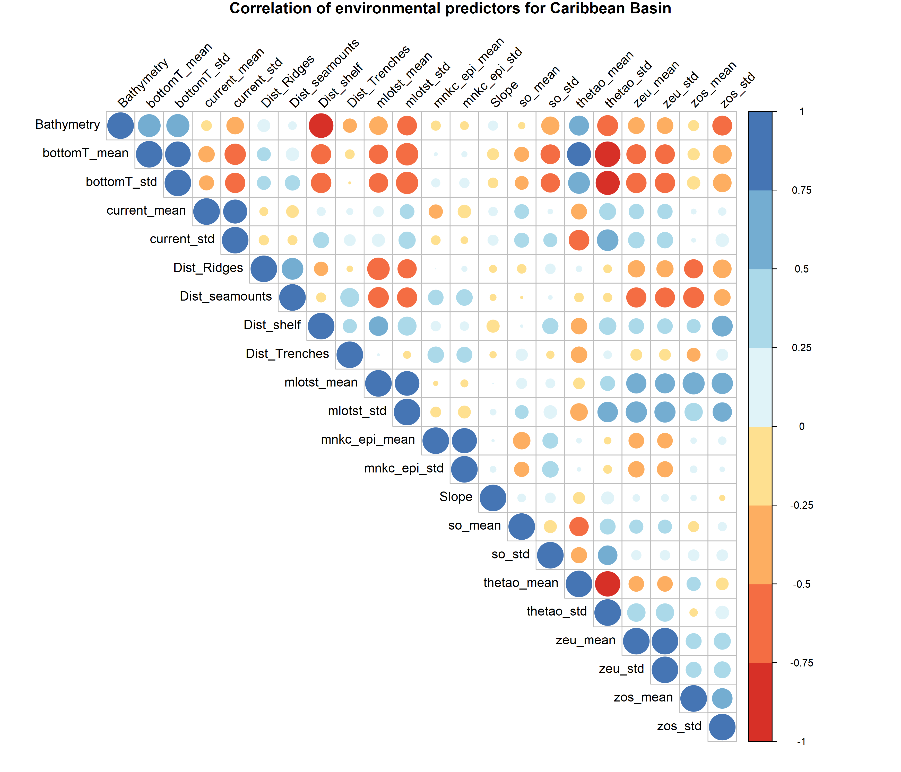

## Data sources

To create the topographic predictors, *General Bathymetric Chart of the Oceans*  (GEBCO, [https://www.gebco.net/](https://www.gebco.net/)) and the *Seafloor Geomorphic Feature Map* ([https://www.bluehabitats.org/?page_id=9](https://www.bluehabitats.org/?page_id=9)) [@Harris2014] were used as spatial data sources. All these data were manually downloaded.

The main data source to obtain the dynamic predictors was the *Copernicus Marine Service Information* ([<https://resources.marine.copernicus.eu/?option=com_csw&task=results](https://resources.marine.copernicus.eu/?option=com_csw&task=results)). The data were downloaded automatically through a [script](https://github.com/ChrisBermudezR/Cetacean_Tourist_Vessel_Collision_Risk_Assessment/blob/main/03_Predictors/01_NetCDF/01_Predictors_Download.py) built in the Python programming language using the [MINICONDA](https://docs.conda.io/en/latest/miniconda.html) frame and the [MOTU](https://help.marine.copernicus.eu/en/articles/4796533-what-are-the-motu-apis#h_3d33beaafc) Client API of the *Copernicus Marine Service*. 


## Data Processing

### Topographic predictors

The GEBCO bathymetry data were used to obtain a bathymetric layer of the study area, this was cut to the boundaries of this area with the "Extract by Mask" tool of the Spatial Analyst extension of the ESRI ArcGIS® program (v. 10.6; @ESRI2017). To obtain the derived slope topographic layer from the GEBCO data, the "Slope" tool of the Spatial Analyst extension of the ESRI ArcGIS®(v. 10.8.1; @ESRI2017) program was used. 

To obtain the layers based on distance to the main geomorphological features, such as "Distance to coast" or "Distance to continental shelf", the "Euclidean Distance" tool of the Spatial Analyst extension of ESRI's ArcGIS® software (v. 10.8.1; @ESRI2017) was used. To obtain these layers and calculate the distances in a proper way and decreasing the calculation errors, first the original projection of the geographic coordinate data (WGS84) was transformed to planar coordinates with the projection Robinson coordinate system using the "Project" tool of the Data Management Tools extension of ESRI's ArcGIS®(v. 10.8.1; @ESRI2017). Once the distance layer was obtained, it was re-projected to geographic coordinates (WGS84) to match the projection of the rest of the data (e.g. Biodiversity and Dynamic data).

*Information about the Robinson Projection used with ESRI's ArcGIS®*

```
World_Robinson
WKID: 54030 Authority: Esri

Projection: Robinson
False_Easting: 0.0
False_Northing: 0.0
Central_Meridian: 0.0
Linear Unit: Meter (1.0)

Geographic Coordinate System: GCS_WGS_1984
Angular Unit: Degree (0.0174532925199433)
Prime Meridian: Greenwich (0.0)
Datum: D_WGS_1984
  Spheroid: WGS_1984
    Semimajor Axis: 6378137.0
    Semiminor Axis: 6356752.314245179
    Inverse Flattening: 298.257223563

```
```{r, out.width='55%', fig.align='center', fig.cap='Figure XXX. Topographic Enviromental Predictors', echo=FALSE}
knitr::include_graphics('Topographic_Predictors.png')
```


### Dynamic predictors

For the dynamic layers, the choice of variables was based on the general ecology of cetacean species, taking into account the sensory scale that these species may present in the chosen study area. We relied on the work of @Torres2017 to determine which variables could be part of the modeling according to the distance at which cetacean species, both dolphins and whales, could sense the environment. For both dolphins and whales, the variables that can be sensed by these species at a distance of more than 10 km (minimum area at which the resolution of the geographic layers is presented) are those that stimulate somatosensory perception and chemoreception [@Torres2017]. 

To obtain the dynamic predictor layers, we used data for nine variables obtained from the **Copernicus Marine Service Information: Global Ocean Physics Reanalysis Glorys 12V1 (PHYS 001-030)** from two datasets. **cmems_mod_glo_bgc_my_0.083deg-lmtl_PT1D-i** and **cmems_mod_glo_phy_my_0.083_P1M-m**. The temporal resolution of the data was monthly with a time window from 1993-01-01 to 2020-05-31. The spatial resolution of the data was 8.5 km (0.085°) and data were extracted not only at the surface but also at depths up to 200 meters, trying to cover the entire epipelagic layer of the ocean where dolphin and whale species have the greatest foraging activity [@Coram2021].

The variables selected were as follows:

1. Mass content of epipelagic micronekton expressed as wet weight in sea water (mnkc_epi [g/m2])
2. Euphotic zone depth (zeu [m])
3. Sea water potential temperature at sea floor (bottomT [°C])
4. Sea surface height above geoid (zos [m])
5. Ocean mixed layer thickness defined by sigma theta (mlotst [m])
6. Sea water potential temperature (thetao [°C])
7. Sea water salinity (so [10-3])
8. Eastward sea water velocity (uo [m/s])
9. Northward sea water velocity (vo [m/s])


Once these data were downloaded in NetCDF format all calculations to obtain the mean and standard deviation, in time and depth of all predictors in the study area, were processed with a [script](https://github.com/ChrisBermudezR/Cetacean_Tourist_Vessel_Collision_Risk_Assessment/blob/main/03_Predictors/01_NetCDF/02_NetCDF_Processing.sh) based on the UNIX shell with the program **Climate Data Operator - CDO** through the Windows Subsystem Linux  (WSL version 2) with the Ubuntu 20.04 LTS distro. To calculate the magnitude of the currents, it was obtained from the eastward seawater velocity (uo [m/s]) and the northward seawater velocity (vo [m/s]) with the following equation: $|v| = \sqrt{(uo)^2 + (vo)^2}$. 


Once all the calculations for each variable are done, usually the raster grids are never aligned, because of this it is possible that the model execution cannot be carried out. Therefore, we developed a [script](https://github.com/ChrisBermudezR/Cetacean_Tourist_Vessel_Collision_Risk_Assessment/blob/main/03_Predictors/01_Predictors_Alignment.R) in the R program [@RTeam2008] using the "*raster*" package (v.3.4-10; @Hijmans2020), to ensure the total alignment of all the grids of the raster layers and also to ensure that all these layers have the same extent, all this without losing the original values. 

```{r, out.width='110%', fig.align='center', fig.cap='Figure XXX. Dynamic Enviromental Predictors.', echo=FALSE}
knitr::include_graphics('Dynamic_Predictors.png')
```


## Selection of Environmental predictors

Because some of the cetacean species or subspecies considered in this study are only distributed in one of the two ocean basins of Colombia, the predictor layers were divided into two representative sets for each basin. After this division, the environmental predictor layers were subjected to a Pearson correlation test (*r*) to rule out any covariation. This test was performed using the "layerstats" tool with the "raster" package [@Hijmans2020] of the R program, all available in this [script](https://github.com/ChrisBermudezR/Cetacean_Tourist_Vessel_Collision_Risk_Assessment/blob/main/03_Predictors/01_Predictors_Alignment.R). The pairs of layers that were correlated with more than an *r* of 0.8, only one of them was selected to be used in the model run. 

For the Caribbean basin, of the 22 predictors considered, five were detected that presented correlations with other predictors with an *r* > 0.75. Bathymetry and distance to the continental shelf had a very strong negative correlation (*r* = -085) and the standard deviation of sea water potential temperature had a strong negative correlation (*r* = -085) with the mean sea water potential temperature, and also with the standard deviation (*r*= -0.82) and mean (*r* = -0.92) of sea water potential temperature at sea floor. The mean sea water potential temperature at sea floor also showed a very strong correlation with the mean sea water potential temperature (*r* = 0.82) (Supplementary Figure XXX).

Only bathymetry and standard deviation of sea water potential temperature were chosen as the final uncorrelated predictors to be used in the model because they can be used as proxies for the other correlated variables. 

 

```{r, out.width='110%', fig.align='center', fig.cap='Supplementary Figure XXX. Pearson correlation matrix of the 22 environmental predictors used to conduct the habitat suitability models in the Colombian Caribbean basin for *Stenella attenuata attenuata* (Caribbean occurrences), *S. frontalis* (Caribbean occurrences), *S. longirostris longirostris* (Caribbean occurrences) and *Tursiops truncatus* (Caribbean occurrences).', echo=FALSE}

```

 
For the Pacific basin, of the 22 predictors considered, 13 were found to have correlations with other predictors with r > 0.75 (Supplementary Figure XXX). The mean sea water potential temperature at sea floor presented three strong positive correlations with bathymetry (*r* = 0.76), the standard deviation of sea water potential temperature at sea floor (*r* = 0.90), and the mean sea water potential temperature (*r* = 0.87). Only the standard deviation of the sea water potential temperature (*r* = -0.85) and the mean sea water salinity (*r* = -0.75) presented a strong negative correlation with this predictor.

The distance to the continental shelf presented a strong negative correlation with the mean and standard deviation of the mass content of epipelagic micronekton (*r* = -0.81 and *r* = -0.76 respectively) and a strong positive correlation with the distance to the trenches (*r* = 0.76).  The mean and standard deviation of the ocean mixed layer thickness showed a very strong positive correlation with each other (*r* = 0.97) and the mean sea water potential temperature showed a strong negative correlation (*r* = -0.86) with the mean sea water potential temperature.


```{r, out.width='110%', fig.align='center', fig.cap='Supplementary Figure XXX. Pearson correlation matrix of the 22 environmental predictors used to conduct the habitat suitability models in the Colombian Caribbean basin for *Megaptera novaeangliae*, *Stenella attenuata attenuata* (Pacific occurrences), *S. attenuata graffmani*, *S. longirostris centroamericana*, *S. longirostris orientalis*  and *Tursiops truncatus* (Pacific occurrences).', echo=FALSE}

```

Finally, the remaining predictors were selected to perform habitat suitability modeling based on previous studies, the ecology of each cetacean species/subspecies and their natural history (Table 1) [@Redfern2017].

In addition, and based on the hypothesis that marine features and dynamic oceanographic conditions influence the distribution of marine cetaceans, we selected environmental predictors that remained within the boundaries of the meso- and macro-scales of sense of dolphins and baleen whales (10 km to 1,000 km distance) [@Torres2017].


# REFERENCES

::: {#refs}
:::

\pagebreak