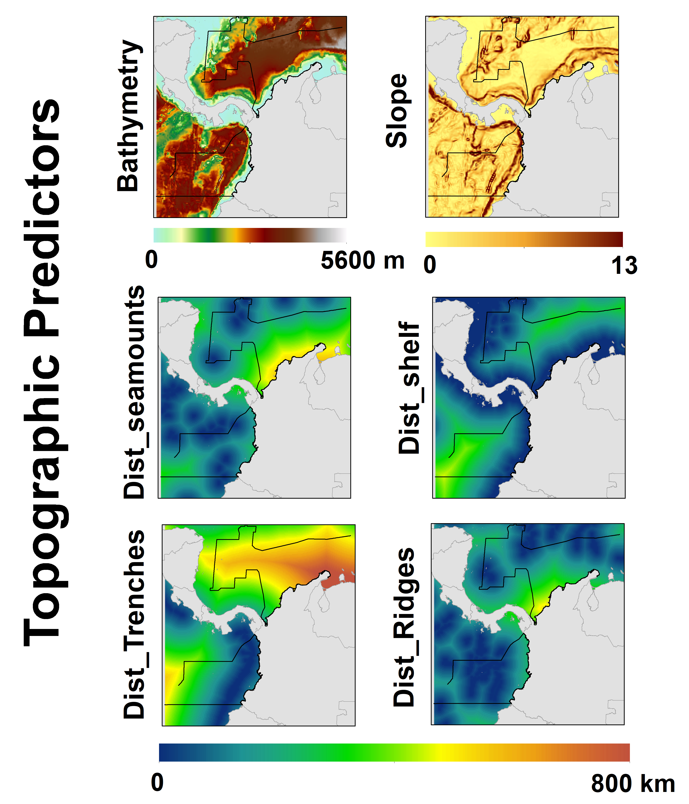
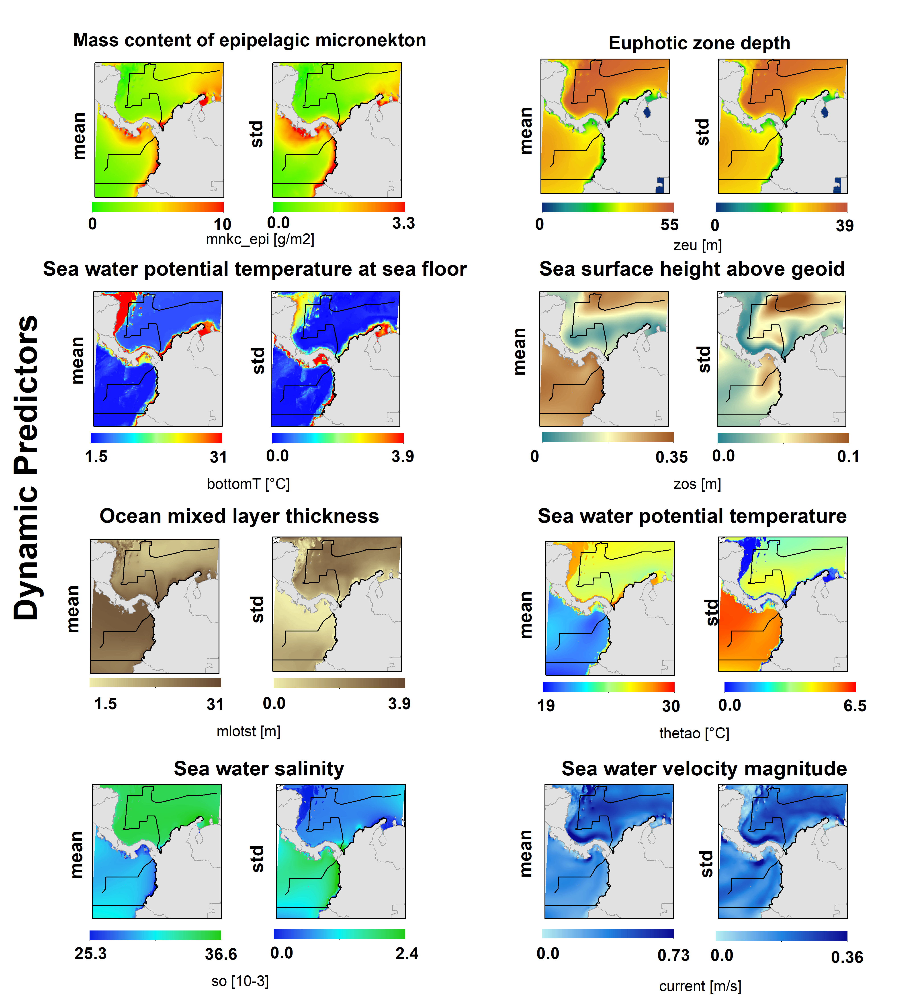

## Data sources

To create the topographic predictors, *General Bathymetric Chart of the Oceans*  (GEBCO, [https://www.gebco.net/](https://www.gebco.net/)) and the *Seafloor Geomorphic Feature Map* ([https://www.bluehabitats.org/?page_id=9](https://www.bluehabitats.org/?page_id=9)) [@Harris2014] were used as spatial data sources. These data were manually downloaded for this study.

The main data source to obtain the dynamic predictors was the *Copernicus Marine Service Information* ([<https://resources.marine.copernicus.eu/?option=com_csw&task=results](https://resources.marine.copernicus.eu/?option=com_csw&task=results)). The data were downloaded automatically through a [script](https://github.com/ChrisBermudezR/Cetacean_Tourist_Vessel_Collision_Risk_Assessment/blob/main/03_Predictors/01_NetCDF/01_Predictors_Download.py) built in the Python programming language using the [MINICONDA](https://docs.conda.io/en/latest/miniconda.html) frame and the [MOTU](https://help.marine.copernicus.eu/en/articles/4796533-what-are-the-motu-apis#h_3d33beaafc) Client API of the *Copernicus Marine Service*. 


## Data Processing

### Topographic predictors

The GEBCO bathymetry data were used to obtain a bathymetric layer of the study area, this was cut to the boundaries of this area with the "Extract by Mask" tool of the Spatial Analyst extension of the ESRI ArcGIS® program (v. 10.6; @ESRI2017). To obtain the derived slope topographic layer from the GEBCO data, the "Slope" tool of the Spatial Analyst extension of the ESRI ArcGIS®(v. 10.8.1; @ESRI2017) program was used. 

```{r, out.width='75%', fig.align='center', fig.cap='**Figure S5**. Distribution of the main geomorphological  (seamounts, shelf, trencehs and ridges) features of the study area.', echo=FALSE}

```

To derive the layers based on the distance to the main geomorphological features, such as 'Distance to coast' or 'Distance to continental shelf', the "Euclidean Distance" tool of the Spatial Analyst extension of ESRI ArcGIS® software (v. 10.8.1; @ESRI2017) was used. To derive these layers accurately and minimize calculation errors, first the original projection of the geographic coordinate data (WGS84) was transformed to planar coordinates with the projection Robinson coordinate system using the "Project" tool of the Data Management Tools extension of ESRI's ArcGIS®(v. 10.8.1; @ESRI2017). The resulting distance layer was then re-projected to geographic coordinates (WGS84) to align with the projection of the other data sets (e.g., biodiversity and dynamic data).

*Information about the Robinson Projection used with ESRI's ArcGIS®*

```
World_Robinson
WKID: 54030 Authority: Esri

Projection: Robinson
False_Easting: 0.0
False_Northing: 0.0
Central_Meridian: 0.0
Linear Unit: Meter (1.0)

Geographic Coordinate System: GCS_WGS_1984
Angular Unit: Degree (0.0174532925199433)
Prime Meridian: Greenwich (0.0)
Datum: D_WGS_1984
  Spheroid: WGS_1984
    Semimajor Axis: 6378137.0
    Semiminor Axis: 6356752.314245179
    Inverse Flattening: 298.257223563

```
```{r, out.width='55%', fig.align='center', fig.cap='**Figure S6**. Topographic Enviromental Predictors', echo=FALSE}

```


### Dynamic predictors

For the dynamic layers, we selected variables based on the sensory capabilities of cetacean species in the study area, using @Torres2017's work as a guide. We chose variables that stimulate somatosensory perception and chemoreception, which can be sensed by dolphins and whales at a distance of more than 10 km.

To create the dynamic predictor layers, we obtained data from the Copernicus Marine Service Information: **Global Ocean Physics Reanalysis Glorys 12V1 (PHYS 001-030)** from two datasets: **cmems_mod_glo_bgc_my_0.083deg-lmtl_PT1D-i and cmems_mod_glo_phy_my_0.083_P1M-m**. The data had a monthly temporal resolution from 1993-01-01 to 2020-05-31 and a spatial resolution of 8.5 km (0.085°). We extracted data not only at the surface but also at depths up to 200 meters to cover the entire epipelagic layer where dolphins and whales species have the greatest foraging activity [@Coram2021].

The selected variables were mass content of epipelagic micronekton  (mnkc_epi [g/m2]), euphotic zone depth (zeu [m]), sea water potential temperature at sea floor (bottomT [°C]), sea surface height above geoid  (zos [m]), ocean mixed layer thickness defined by sigma theta  (mlotst [m]), sea water potential temperature (thetao [°C]), sea water salinity  (so [10-3]), eastward sea water velocity  (uo [m/s]), and northward sea water velocity  (vo [m/s]). We calculated the mean and standard deviation of all predictors in the study area using a script based on the UNIX shell with the program Climate Data Operator - CDO through the Windows Subsystem Linux (WSL version 2) using the Ubuntu 20.04 LTS distro. To align the raster layers, we developed a script in R using the raster package (v.3.4-10; @Hijmans2020), ensuring that all grids had the same extent without losing the original values.

```{r, out.width='110%', fig.align='center', fig.cap='**Figure S7**. Dynamic Enviromental Predictors.', echo=FALSE}

```


## Selection of Environmental predictors

As some cetacean species or subspecies considered in this study are only found in one of the two ocean basins of Colombia, we divided the predictor layers into two sets, one for each basin. We then conducted a Pearson correlation test (r) on the environmental predictor layers to identify and exclude any layers with high covariation. To perform this test, we used the "layerstats" tool in the R program's "raster" package [@Hijmans2020], which can be found in this script (https://github.com/ChrisBermudezR/Cetacean_Tourist_Vessel_Collision_Risk_Assessment/blob/main/03_Predictors/01_Predictors_Alignment.R). If two layers were found to have an r value greater than 0.8, we only used one of them in the model run.

For the Caribbean basin, we detected five predictors out of the 22 considered that had correlations with other predictors with an r greater than 0.75. We found that bathymetry and distance to the continental shelf had a very strong negative correlation (*r* = -0.85), while the standard deviation of sea water potential temperature had a strong negative correlation (*r* = -0.85) with the mean sea water potential temperature, as well as with the standard deviation (*r* = -0.82) and mean (*r* = -0.92) of sea water potential temperature at the sea floor. In addition, the mean sea water potential temperature at the sea floor was found to have a very strong correlation with the mean sea water potential temperature (*r* = 0.82) (see Figure S8). After analyzing these correlations, we decided to only use bathymetry and standard deviation of sea water potential temperature as final uncorrelated predictors in the model, as they can be used as proxies for the other correlated variables.

 

```{r, out.width='110%', fig.align='center', fig.cap='**Figure S8**. Pearson correlation matrix of the 22 environmental predictors used to conduct the habitat suitability models in the Colombian Caribbean basin for *Stenella attenuata attenuata* (Caribbean occurrences), *S. frontalis* (Caribbean occurrences), *S. longirostris longirostris* (Caribbean occurrences) and *Tursiops truncatus* (Caribbean occurrences).', echo=FALSE}
knitr::include_graphics('corr_Matrix_Caribbean.png')
```

 
Of the 22 predictors considered for the Pacific basin, 13 were found to have correlations with other predictors with an r greater than 0.75 (see Supplementary Figure XXX). The mean sea water potential temperature at the sea floor exhibited three strong positive correlations with bathymetry (*r* = 0.76), the standard deviation of sea water potential temperature at the sea floor (*r* = 0.90), and the mean sea water potential temperature (*r* = 0.87). Only the standard deviation of sea water potential temperature (*r* = -0.85) and the mean sea water salinity (*r* = -0.75) presented a strong negative correlation with this predictor.

The distance to the continental shelf showed a strong negative correlation with the mean and standard deviation of the mass content of epipelagic micronekton (*r* = -0.81 and *r* = -0.76, respectively) and a strong positive correlation with the distance to the trenches (*r* = 0.76). The mean and standard deviation of ocean mixed layer thickness exhibited a very strong positive correlation with each other (*r* = 0.97), and the mean sea water potential temperature showed a strong negative correlation (*r* = -0.86) with the mean sea water potential temperature (see Figure S9).


```{r, out.width='110%', fig.align='center', fig.cap='**Figure S9**. Pearson correlation matrix of the 22 environmental predictors used to conduct the habitat suitability models in the Colombian Caribbean basin for *Megaptera novaeangliae*, *Stenella attenuata attenuata* (Pacific occurrences), *S. attenuata graffmani*, *S. longirostris centroamericana*, *S. longirostris orientalis*  and *Tursiops truncatus* (Pacific occurrences).', echo=FALSE}
knitr::include_graphics('corr_Matrix_Pacific.png')
```


Finally, we selected the remaining predictors to perform habitat suitability modeling based on previous studies, the ecology of each cetacean species/subspecies, and their natural history (refer to **Table 1**) [@Redfern2017].

Moreover, as we hypothesized that marine features and dynamic oceanographic conditions influence the distribution of marine cetaceans, we selected environmental predictors that remained within the boundaries of the meso- and macro-scales of sense of dolphins and baleen whales (*i.e.*, distances ranging from 10 km to 1,000 km) [@Torres2017]."


# REFERENCES

::: {#refs}
:::

\pagebreak