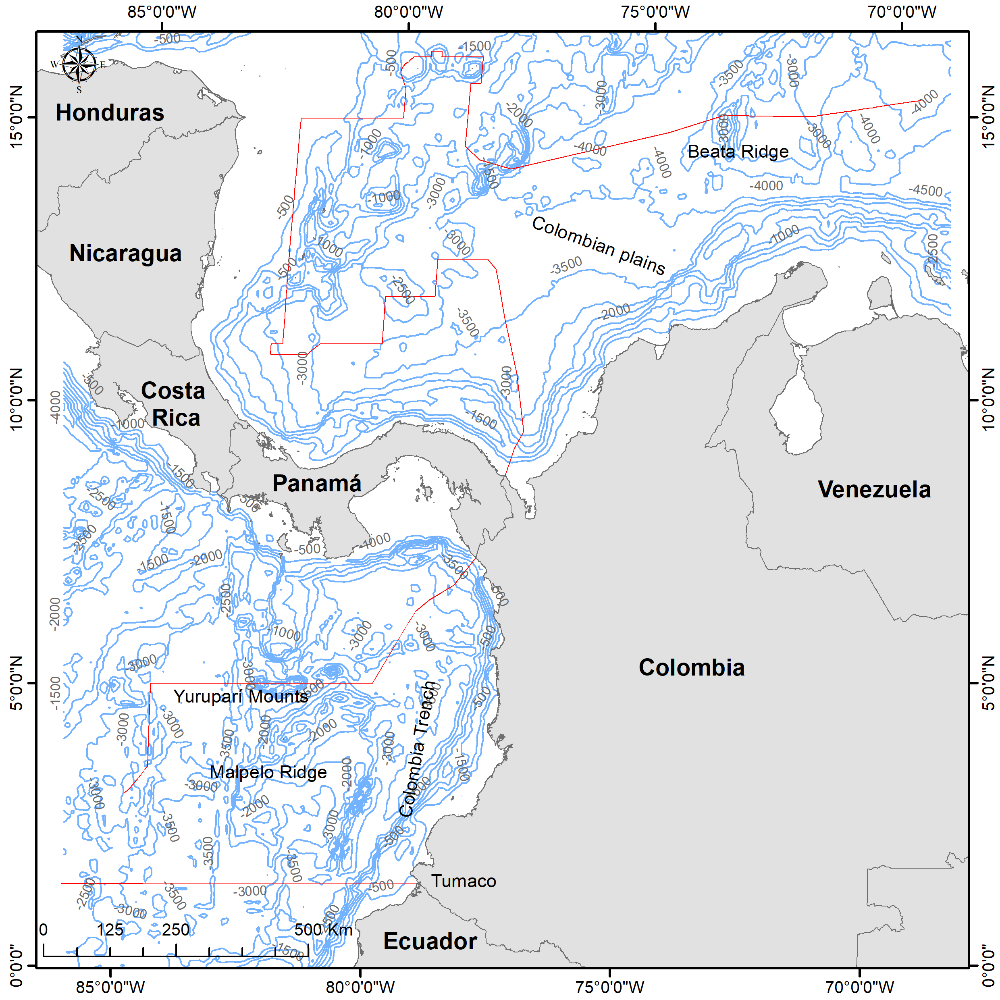

The Colombian state officially recognizes limits in the Caribbean Basin that enclose an area of approximately 589,302 $km^2$, while the Pacific Basin covers an area of 332,129 $km^2$. As of the present study, seven protected areas are recognized in the Caribbean Exclusive Economic Zone (EEZ) and six protected areas in the Pacific


```{r, out.width='75%', fig.align='center', fig.cap='**Figure 1.** Study area with the location of marine protected areas and main ports in the Colombian Exclusive Economic Zone (EEZ).', echo=FALSE}
knitr::include_graphics('Figure_01.png')
```

The Colombian Caribbean is typically oligotrophic, except for some coastal regions such as Puerto Bolívar (La Guajira department) and Santa Marta (Magdalena department), where seasonal upwelling events increase coastal productivity, allowing for the presence of top predators such as cetaceans [@Andrade2003; @Andrade2005; @barraganLuna2019; @CrialesHernandez2006; @Fajardo1979; @FarasCurtidor2017; @Gordon1967Circulation; @Gutierrez2015; @Lonin2010Atmospheric; @Paramo2011; @RuedaRoa2013].). On the other hand, the Colombian Pacific is influenced by year-round coastal upwelling events, particularly during the months of February to April and November to December, as reported by Villegas [-@Villegas1997;-@Villegas2003] and @Diaz2008. This leads to high productivity in coastal areas, particularly in the Gorgona Island National Natural Park (NNP) [@Pineda1995].


```{r, out.width='75%', fig.align='center', fig.cap='**Figure S1.** Contour lines of the bathymetry of the study area.', echo=FALSE}

```


Both the Caribbean and Pacific areas in Colombia are influenced by tourism-related vessel activities. However, the main tourist attractions are different in each region. In the Caribbean, water tourism is focused mainly on cruise ships and diving activities, while in the Pacific, tourist vessel traffic is primarily for nature activities such as diving and whale-watching [@AguileraDiaz2006; @Brida2012; @Sanchez2010; @Trujillo2013 ]. These differences are reflected in the tourist infrastructure, which is highly developed in the Colombian Caribbean with cities like Cartagena de Indias having a large hotel development [@AguileraDiaz2006; @Brida2012; @SanchezFernandez2010]. On the other hand, the Pacific region is more pristine and ecotourism and whale-watching activities are predominant, as the region is highly biodiverse and part of the breeding zone for stock G humpback whales [@Acevedo2017; @AguayoLobo2011; @Fagua2019; @FlorezGonzalez2007; @Sanchez2010; @Trujillo2013].

# REFERENCES

::: {#refs}
:::

\pagebreak