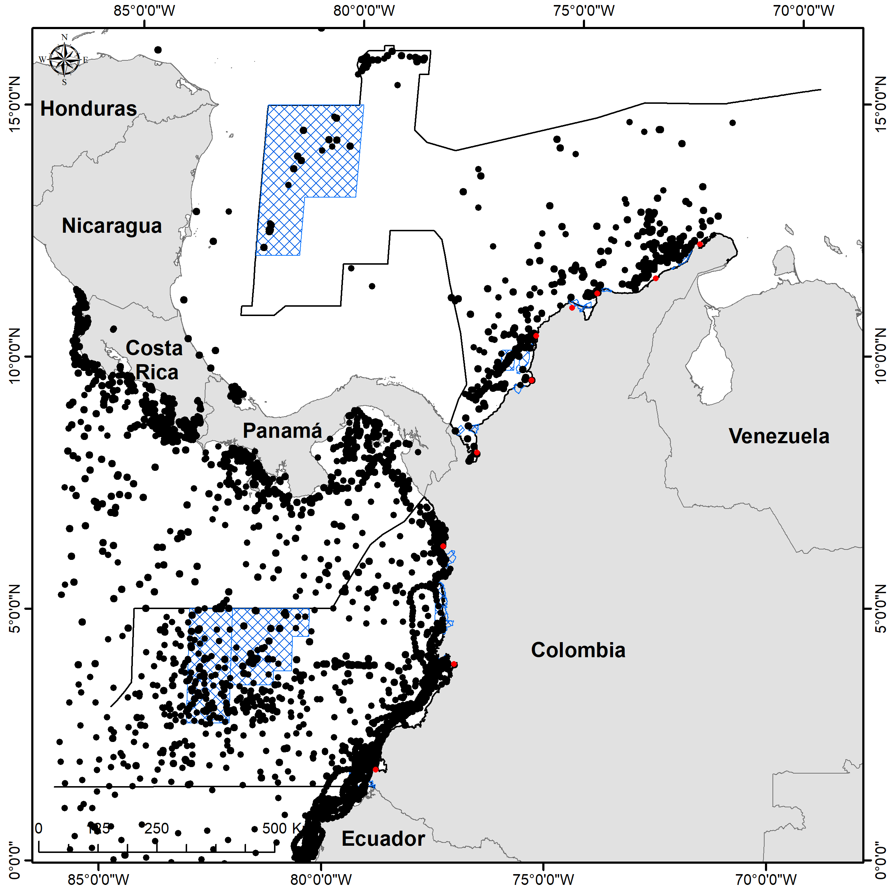

Officially, the Colombian state recognizes limits in the Caribbean Basin that enclose an area of approximately 589,302 $km^2$ and in the Pacific Basin with a total area of 332,129 $km^2$. As of the date of this study, seven protected areas are recognized in the Caribbean EEZ and six protected areas in the Pacific.

```{r, out.width='75%', fig.align='center', fig.cap='Figure 1. Study area with the location of marine protected areas and main ports in the Colombian Exclusive Economic Zone (EEZ).', echo=FALSE}
knitr::include_graphics('Figure_01.png')
```

The Colombian Caribbean is considered oligotrophic, excepting in some coastal regions, such as Puerto Bolivar (La Guajira department) and Santa Marta (Magdalena department), where seasonal upwelling events that increase productivity in coastal areas allow occurrence of top predators such as cetaceans [@Andrade2003; @Andrade2005; @barraganLuna2019; @CrialesHernandez2006; @Fajardo1979; @FarasCurtidor2017; @Gordon1967Circulation; @Gutierrez2015; @Lonin2010Atmospheric; @Paramo2011; @RuedaRoa2013]. Conversely, the Colombian Pacific is influenced by coastal upwelling events thoroughly year, especially on February-April and November-December months [@Diaz2008; @Villegas1997; @Villegas2003] maintaining high productivity in coastal areas, especially in the Gorgona Island National Natural Park (NNP) [@Pineda1995].


```{r, out.width='75%', fig.align='center', fig.cap='Supplementary Figure 1. contour lines of the bathymetry of the study area.', echo=FALSE}
knitr::include_graphics('SuppFig01.png')
```


```{r, out.width='75%', fig.align='center', fig.cap='Supplementary Figure 2. Distribution of the main geomorphological  (seamounts, shelf, trencehs and ridges) features of the study area.', echo=FALSE}

```


Both Caribbean and Pacific areas are influenced by tourism-vessel activities in Colombia; however, the main tourist purposes are different for each region. In the Caribbean, water tourism has been focused mainly on cruise ships and diving activities while in the Pacific tourist vessel traffic is principally for nature activities such as diving and whale-watching onboard pleasure vessels and small boats, respectively [@AguileraDiaz2006; @Brida2012; @Sanchez2010; @Trujillo2013 ]. These differences are based on tourist infrastructure, which is highly developed in the Colombian Caribbean in contrast to the Pacific region. Along the 1,600 km of the Colombian Caribbean coastline are located tourist cities such as Cartagena de Indias, which has a greater hotel development [@AguileraDiaz2006; @Brida2012; @SanchezFernandez2010]. Conversely, the Pacific holds more pristine areas, being the ecotourism and the whale-watching activities predominant, because the Colombian Pacific is highly biodiverse and is part of the breeding zone for stock G humpback whales [@Acevedo2017; @AguayoLobo2011; @Fagua2019; @FlorezGonzalez2007; @Sanchez2010; @Trujillo2013].

# REFERENCES

::: {#refs}
:::

\pagebreak